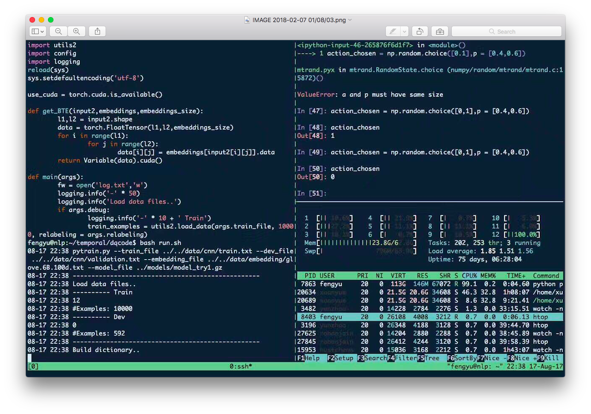

#  Awesome-Mac

Recently, several friends asked me to recommend awesome applications for their Macs, so I decided to create this repo to share some useful applications. Feel free to PR if you also want to share with us your fantastic world of Mac.

---

Let's start from a world "Replacement". Some basic applications created by Apple such as Finder, Mail, Terminal，Spotlight, Stickies, Reminders, are good but not best. They can be replaced by other excellent apps.

#### 1 [ForkLift](https://www.binarynights.com/forklift/)
_Advanced dual pane file manager and file transfer client for macOS.  -- Replacement for_ __Finder__

 

#####_Useful features_

* __Dual pane__ -- Move files more conveniently. (Do not need to open two Finders)
* __Remote Connections__ -- Connect to SFTP, FTP, WebDAV, Amazon S3, Google Drive, Rackspace CloudFiles, SMB, AFP, and NFS remote volumes and easily manage your files quickly across networks.
* __Git Support__ ForkLift knows git and will show you the status of individual files. You can add, commit, push, and pull.
* __Open Current Files in Terminal__ Open a Terminal, iTerm, or Hyper window at your current local path.
* __File Compare__ Compare two text or images files with Xcode's FileMerge, Kaleiodoscope, Beyond Compare, or Araxis Merge.
* __Dark Mode__ For those who love dark mode.

#### 2 [Airmail](http://airmailapp.com/)
_WWDC17 Apple Design Award Winner. Lightning-fast email client for Mac  -- Replacement for_ __Mail__

#####_Useful features_

* __A pretty face__
* Compose messages in __Markdown.__
* __Integrate__ Calender, Reminders, OmniFocus and so on.
* __Customization/Widgets__ Plugin Framework API

#### 3 [iTerm2](https://www.iterm2.com/) with [tmux](https://github.com/tmux/tmux/wiki)
_iTerm2 is a terminal emulator for macOS that does amazing things -- Replacement for_ __Terminal__

#####_Useful features_

* __Hotkey Window__
* __Support mouse actions__
* __256 Colors__
* __shell integration__
* __imgcat integration__

