#  Awesome-Mac

[](https://awesome.re)

Recently, several friends asked me to recommend awesome applications for their Macs, so I decided to create this repo to share some useful applications. __Feel free to PR if you also want to share us with your fantastic world of Mac.__

**Table of Contents**

- [Section1  Replacement](#section1--replacement)
  - [1 ForkLift](#1-forklift)
  - [2 Airmail](#2-airmail)
  - [3 iTerm2 with tmux](#3-iterm2-with-tmux)
  - [4 Alfred](#4-alfred)
    - [Multi Search](#multi-search)
    - [Open a application](#open-a-application)
    - [Run command](#run-command)
    - [Search a movie/book/music from Douban](#search-a-moviebookmusic-from-douban)
    - [Dictionary](#dictionary)
    - [Add a reminder](#add-a-reminder)
    - [Check my shutuo](#check-my-shutuo)
    - [Find contact in wechat](#find-contact-in-wechat)
    - [Check Express Status](#check-express-status)
  - [5 FiveNotes](#5-fivenotes)
  - [6 GoodTask 3](#6-goodtask-3)
  - [7 Daisydisk](#7-daisydisk)
  - [8 Telegram](#8-telegram)
- [Section2  Daily](#section2--daily)
  - [9 Paste](#9-paste)
  - [10 Magnet](#10-magnet)
  - [11 TextExpander](#11-textexpander)
  - [12 Wallbot](#12-wallbot)
  - [13 Focus](#13-focus)
  - [14 KeepingYouAwake](#14-keepingyouawake)
  - [15 Money Pro](#15-money-pro)
- [Section3  Others](#section3--others)
  - [16 GeekTool](#16-geektool)
  - [17 Dash](#17-dash)
  - [18 Omnigraph](#18-omnigraph)
  - [19 Prism](#19-prism)
  - [20 Quiver](#20-quiver)
  - [21 PDF Expert](#21-pdf-expert)
  - [22 SourceTree](#22-sourcetree)
  - [23 Countdown Widget](#23-countdown-widget)
  - [24 MarginNote X](#24-marginnote-x)
  - [25 MindNode](#25-mindnode)
- [Similar Awesome Links](#similar-awesome-links)

### Section1  Replacement

Let's start from a world "Replacement". Some basic applications created by Apple such as Finder, Mail, Terminal，Spotlight, Stickies, Reminders, are good but not the best. They can be replaced by other excellent apps.

#### 1 [ForkLift](https://www.binarynights.com/forklift/)
_Advanced dual pane file manager and file transfer client for macOS.  -- Replacement for_ __Finder__

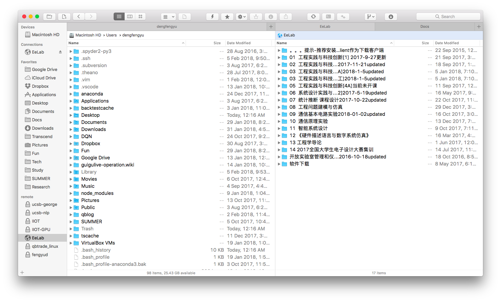 

___Useful features___

* __Dual pane__ -- Move files more conveniently. (Do not need to open two Finders)
* __Remote Connections__ -- Connect to SFTP, FTP, WebDAV, Amazon S3, Google Drive, Rackspace CloudFiles, SMB, AFP, and NFS remote volumes and easily manage your files quickly across networks.
* __Git Support__ ForkLift knows git and will show you the status of individual files. You can add, commit, push, and pull.
* __Open Current Files in Terminal__ Open a Terminal, iTerm, or Hyper window at your current local path.
* __File Compare__ Compare two text or images files with Xcode's FileMerge, Kaleiodoscope, Beyond Compare, or Araxis Merge.
* __Dark Mode__ For those who love dark mode.

#### 2 [Airmail](http://airmailapp.com/)
_WWDC17 Apple Design Award Winner. Lightning-fast email client for Mac  -- Replacement for_ __Mail__

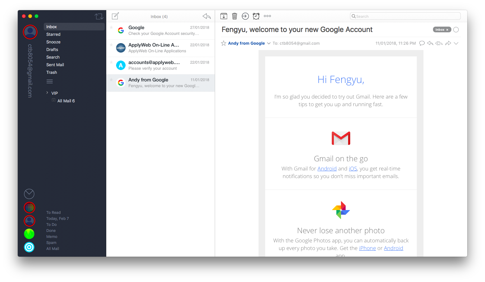

___Useful features___

* __A pretty face__
* Compose messages in __Markdown.__
* __Integrate__ Calender, Reminders, OmniFocus and so on.
* __Customization/Widgets__ Plugin Framework API

#### 3 [iTerm2](https://www.iterm2.com/) with [tmux](https://github.com/tmux/tmux/wiki)
_iTerm2 is a terminal emulator for macOS that does amazing things -- Replacement for_ __Terminal__


___Useful features___

* __Hotkey Window__
* __Support mouse actions__
* __256 Colors__
* __shell integration__
* __imgcat integration__

#### 4 [Alfred](https://www.alfredapp.com/)
_Alfred is an award-winning app for Mac OS X which boosts your efficiency with hotkeys, keywords, text expansion and more. -- Replacement for_ __Spotlight__


Alfred is definitely the most powerful tools. You can almost do whatever you want in this small window. I just list several examples.

___Later I will create a separate page to introduce Alfred___


##### Multi Search

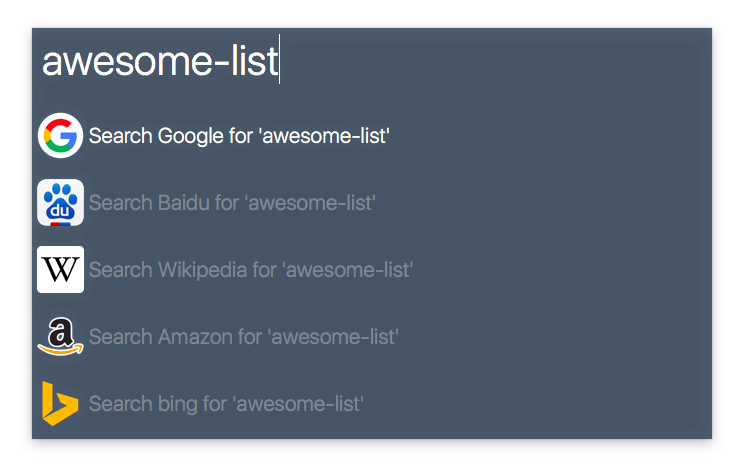

##### Open a application

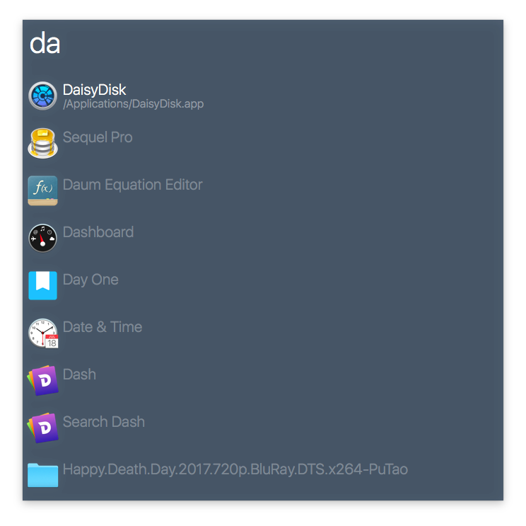

##### Run command

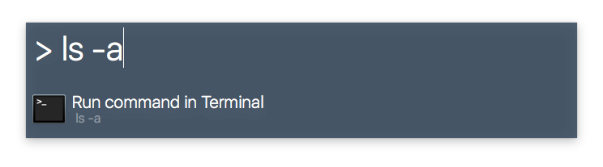

##### Search a movie/book/music from Douban

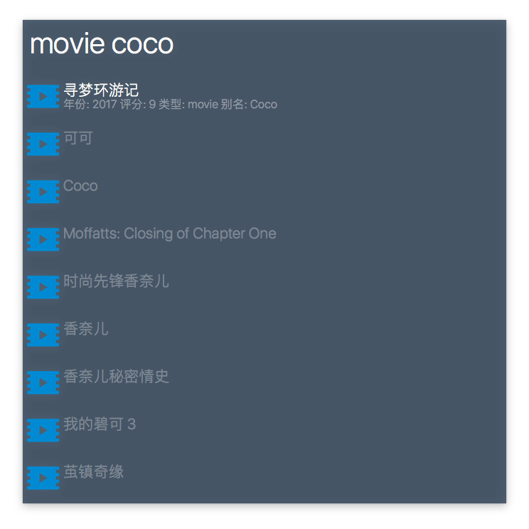

##### Dictionary

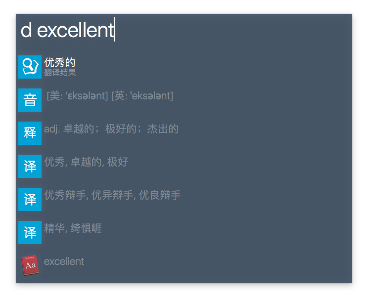

##### Add a reminder


##### Check my shutuo


##### Find contact in wechat


##### Check Express Status

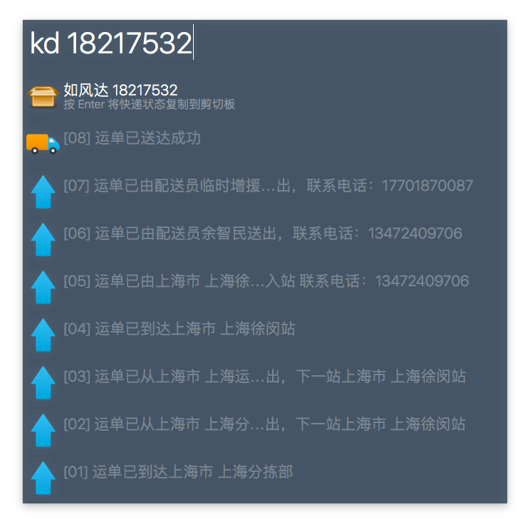

#### 5 [FiveNotes](http://www.apptorium.com/fivenotes)

_FiveNotes is a small text editor that you can always access by clicking (or pressing shortcut keys) on its Status bar icon. Even if you're working on a full screen app. -- Replacement for_ __Stickies__

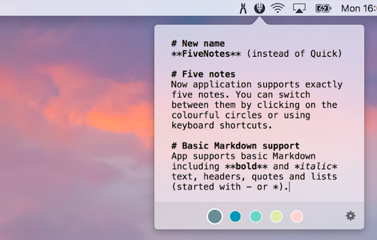

It's very small, simple and convenient. When I suddenly have some new thoughts or plans, I will write them down first in FiveNotes as temporary notes. It supports basic markdown formatting.


#### 6 [GoodTask 3](http://goodtaskapp.com/mac/index.html)

_GoodTask 3 is a task manager based on Apple's stock Reminders and Calendars. It add rich functions top on Apple's Reminders and Calendars -- Replacement for_ __Reminders__

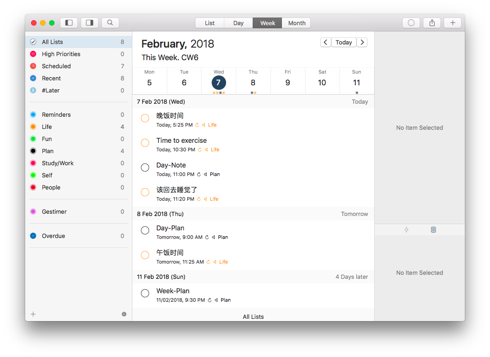

It add many useful functions on Apple stock Reminders. For example, you can see your list in a day, a week and a month, which seems more intuitive. It also syncs with Apple's Stock Reminders & Calendars. I usually use this app to help me organize and reminder routine matters.

#### 7 [Daisydisk](https://daisydiskapp.com/)
_Daisydisk shows you exactly what’s taking up all that space and helps you clear it out, all with a fun and interesting UI -- Replacement for_ __Disk Management__

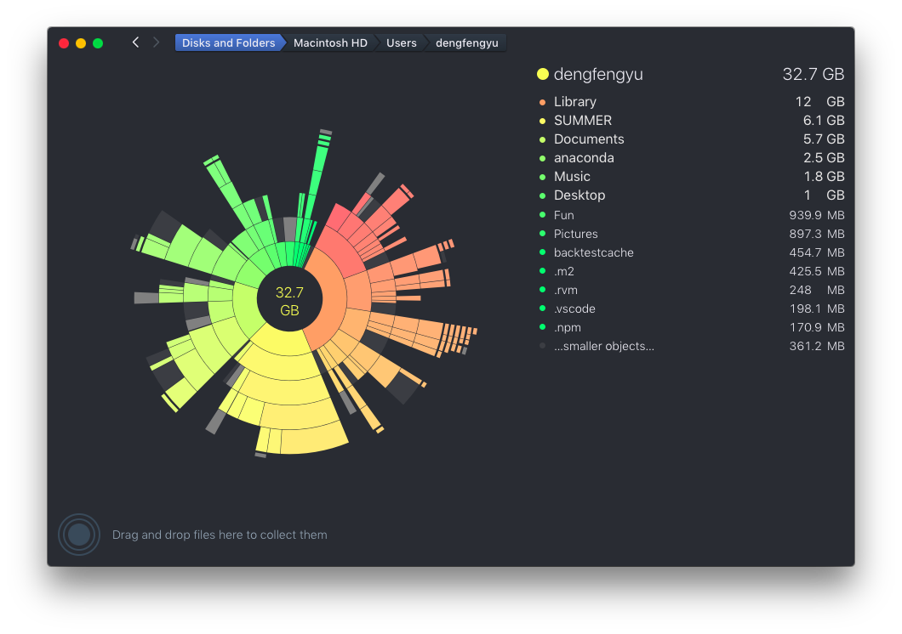

You can not image that how frequently I use this app when my Mac's SSD is only 128G.

#### 8 [Telegram](https://macos.telegram.org/)

_Telegram is a cloud-based mobile and desktop messaging app with a focus on security and speed. -- Replacement for_ __Wechat__

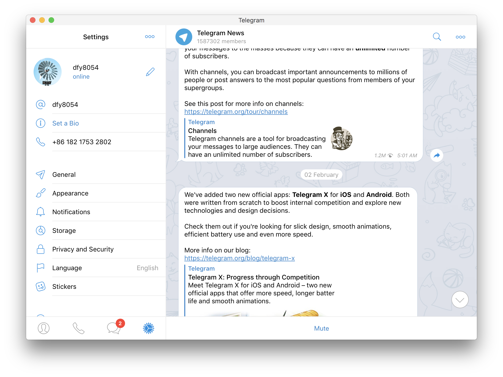

___Useful features___

* Help us get away from the __Watching__ of Wechat.
* __Security__ Guaranteed by the algorithm.


---

### Section2  Daily

In this section, I will introduce some other applications which I use nearly everyday.

#### 9 [Paste](https://pasteapp.me/)

_Paste is a smart cloud clipboard history and snippets manager for Mac.
It keeps everything you copy and lets you use it again and again
whenever you need it on all your devices._

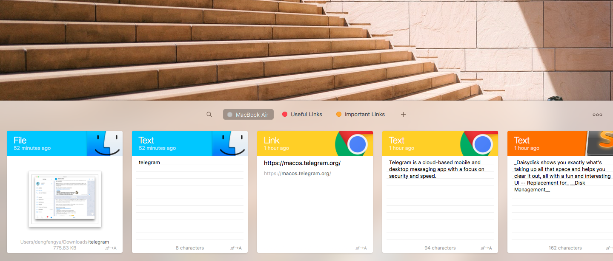

With this app, I can store my recent 500 copies including files, photos and texts. When I need them again, I can look through to find them or directly search the relevant keywords. I can even add my personal folder to store useful information forever.

#### 10 [Magnet](http://magnet.crowdcafe.com/)

_Activated by dragging, customizable keyboard shortcuts or via menu bar, Magnet declutters your screen by snapping windows into organized tiles._

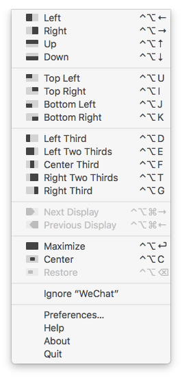

You can use this app to split your screen at an amazing speed through keyboard shortcuts.

#### 11 [TextExpander](https://textexpander.com/)

_TextExpander lets you instantly insert snippets of text from a repository of emails, boilerplate and other content, as you type – using a quick search or abbreviation._

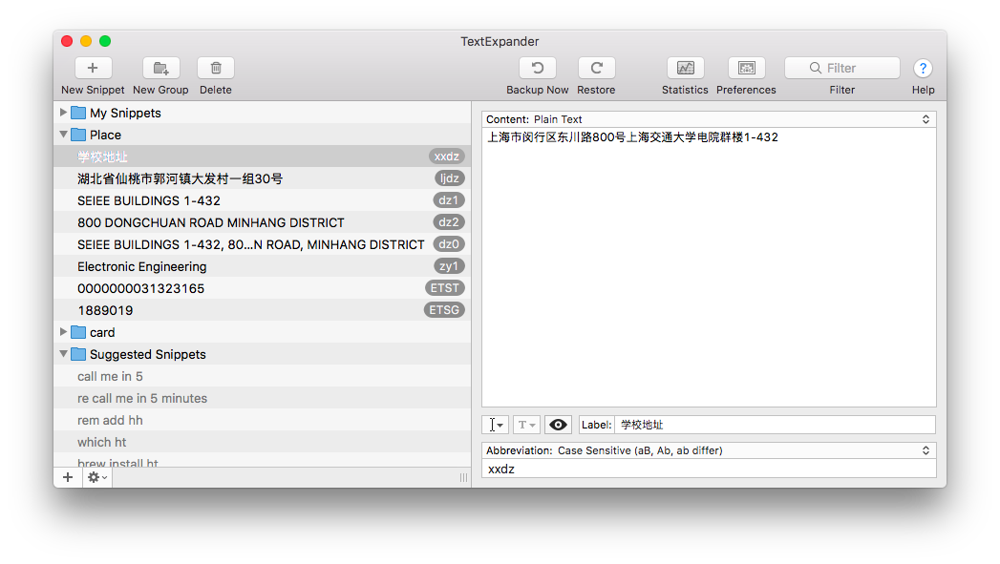

This application gives me a fantastic experience. For example, when I apply for graduate school, I need to fill out same information on different school. I use <font color=#5898CD>DP</font> to represent <font color=#5898CD>Distinguished Professor, Assistant Dean</font>, I use <font color=#5898CD>ETST</font> to represent my ToEFL Register Number <font color=#5898CD>0000000031323165</font>. This app not only helps me type these information more quickly, but more important, helps me guarantee what I fill out are absolutely right. 

#### 12 [Wallbot](https://twitter.com/wall_bot_paper?ref=producthunt)

_WallBot is an macOS wallpaper app with Machine Learning and rich content._

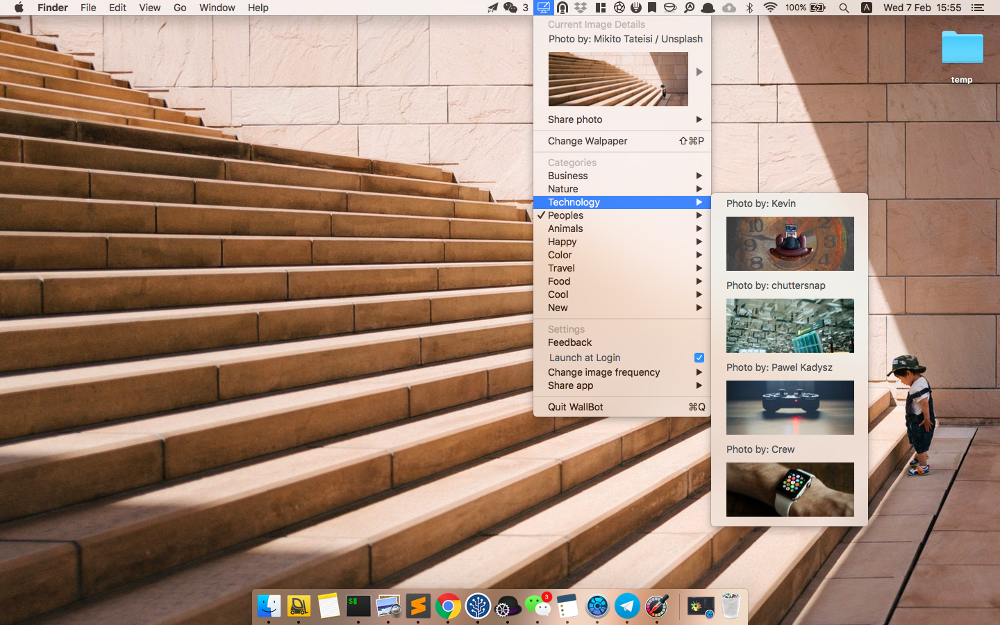

It's wallpapers are all from [Unsplash](https://unsplash.com/)(Beautiful, free photos. Gifted by the world’s most generous community of photographers). They are in high quality and unique spirit. WallBot keeps updating them on your desktop at a given frequency. Each time, it will ask you whether like the new one, then it will use the feedback to trace your preference, for later update.

#### 13 [Focus](https://heyfocus.com/)

_Focus is a Mac menu-bar app that helps you find your zen. One click creates an optimal work environment. When a distracting applications or website is blocked, a motivational quote is shown to get you back on track and improve your productivity._

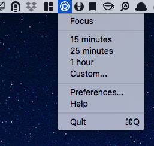

When I want to focus on what I am doing, I will turn focus on, then distracting applications will exit.

#### 14 [KeepingYouAwake](https://github.com/newmarcel/KeepingYouAwake)
_KeepingYouAwake is a small menu bar utility for macOS that can prevent your Mac from entering sleep mode for a predefined duration or as long as it is activated._


It's not rare you are downloading something and leave for a while, when you came back, you Mac got to sleep and the download process stopped. However, with KeepingYouAwake, you Mac can keep awake. For example, when I want to watch a movie, I start a download process and turn on this app, then take a shower. After I come back, the download task is finished and I can watch the movie directly.


#### 15 [Money Pro](http://ibearmoney.com/pro/overview-mac.html)

_Money Pro is the one place for bill planning, budgeting and keeping track of your accounts. Easy sync with iPhone/iPad versions. Money Pro works great for home budgeting and even for business use._

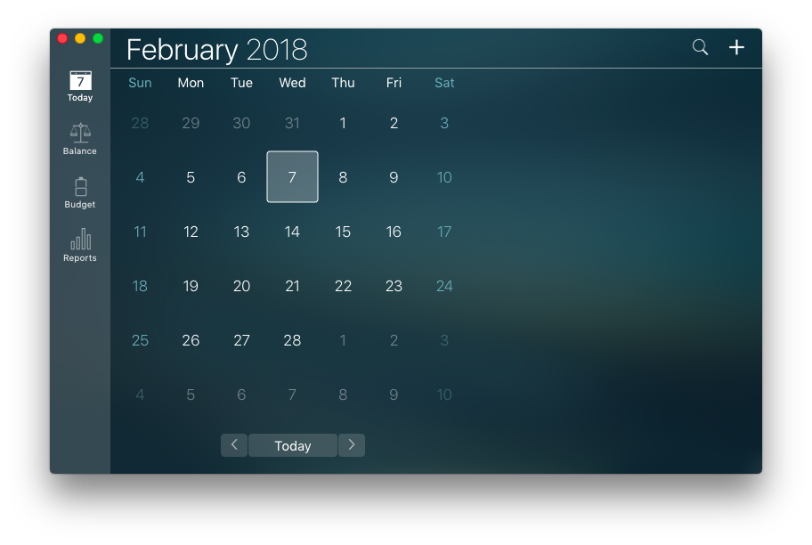

___Useful features___

* Calendar and Today view
* Bills due notifications
* Import of bank statements
* Detailed reports

--- 

### Section3  Others

#### 16 [GeekTool](https://www.tynsoe.org/v2/geektool/)

_GeekTool is a macOS application that lets you customize your desktop with great flexibility._

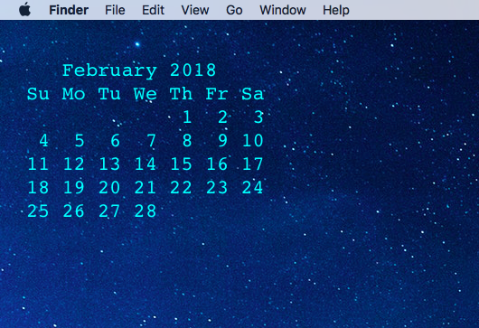

If I want to add a calender to my desktop. Then I can create a shell geeklets in GeekTool and type command ```cal```. In fact, using GeekTool, I can put anything I want to the desktop such as a countdown.

Apart from customizing you desktop. You can also use scripts customize your Menubar, your Notification and your Dock. 

* Desktop __GeekTool / [Ubersicht](http://tracesof.net/uebersicht/)__
* Menubar __[TextBar](http://richsomerfield.com/apps/textbar/)__
* Notification __[Today Scripts](https://github.com/SamRothCA/Today-Scripts)__
* Dock __[HyperDock](https://bahoom.com/hyperdock/)__

#### 17 [Dash](https://kapeli.com/dash)

_Dash is an API Documentation Browser and Code Snippet Manager. Dash stores snippets of code and instantly searches offline documentation sets for 200+ APIs, 100+ cheat sheets and more. You can even generate your own docsets or request docsets to be included._


Dash almost including all official documentations and snippets you want. If you forget the usage of something, you can always find it in Dash.

#### 18 [Omnigraph](https://www.omnigroup.com/omnigraffle)

_OmniGraffle is for creating precise, beautiful graphics: website wireframes, electrical systems, family trees and maps of software classes come to life in OmniGraffle 7. Everyone from professional artists and designers to casual data mappers and beginning diagrammers will find something new in OmniGraffle 7._

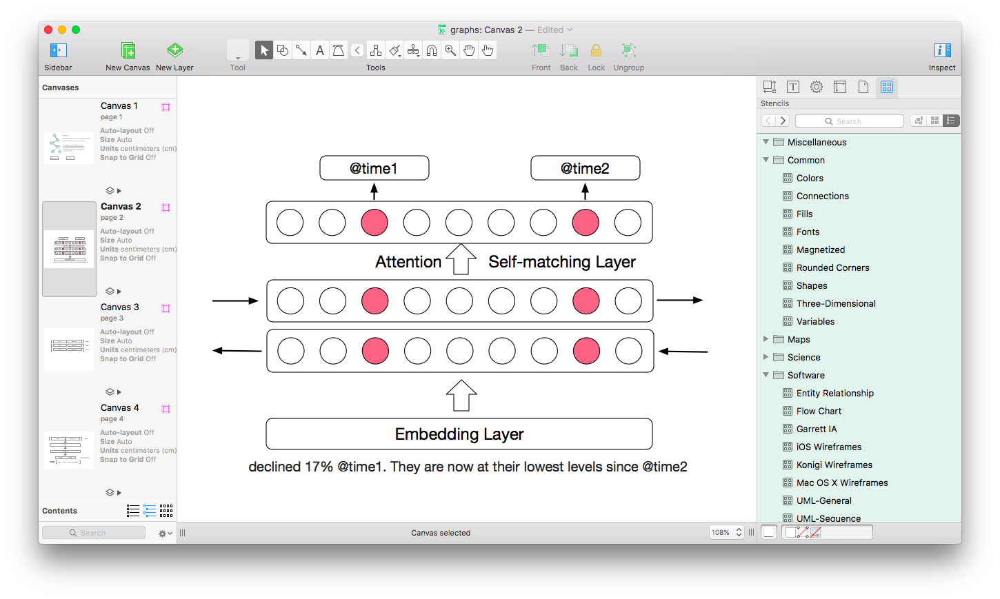

Omnigrafe is very convenient to draw diagrammers. It's structure is similar with Photoshop. You will be amazed by what you draw with Omnigrafe.

#### 19 [Prism](https://www.graphpad.com/scientific-software/prism/)
_GraphPad Prism, available for both Windows and Mac computers,  combines scientific graphing, comprehensive curve fitting (nonlinear regression), understandable statistics, and data organization._

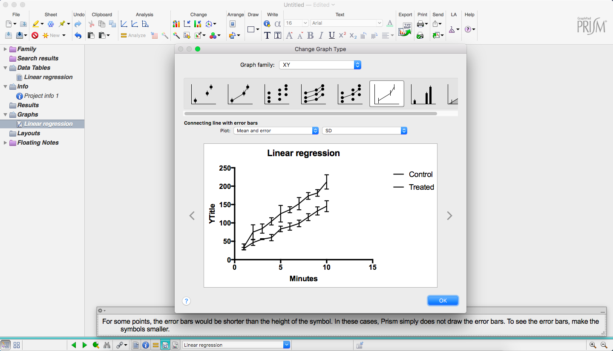

I have been finding this kind of applications for so long. For diagrammers, I have Omnigrafe, but for statistical graph, I have no choice but Matlab, which take 11.5G of my 128G Mac. More importantly, Matlab is hard to use. I finally meet Prism. It's size is only about 500M, and it's ability to draw statistical graphs is more powerful.

#### 20 [Quiver](http://happenapps.com/)

_Quiver is a notebook built for programmers. It lets you easily mix text, code, Markdown and LaTeX within one note, edit code with an awesome code editor, live preview Markdown and LaTeX, and find any note instantly via the full-text search._

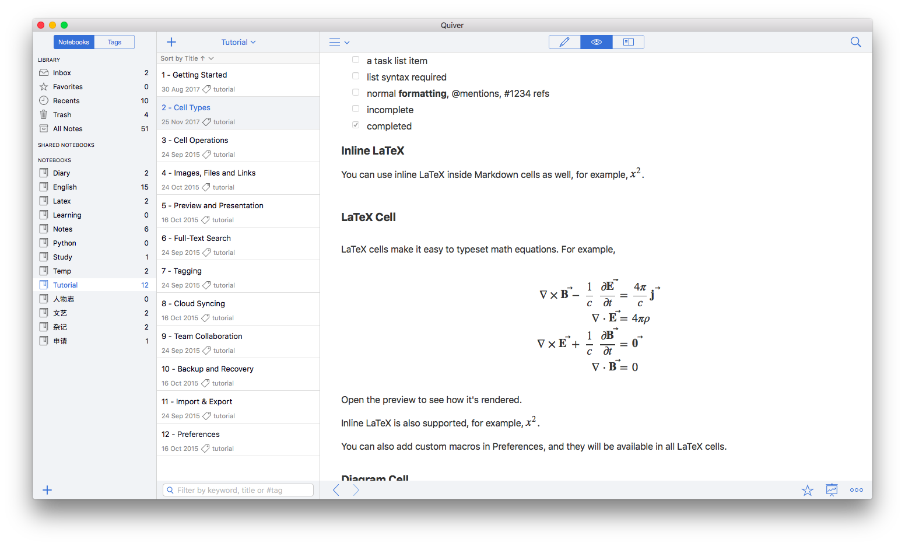

Although many similar notebook applications such as Evernote, OneNote, DayOne are very good, I turn to Quiver. The reason is that it combines Latex cells, which means that I can even write down critical mathematic formulations conveniently when I take part in a research meeting.

#### 21 [PDF Expert](https://pdfexpert.com/)

_From the first document you select, PDF Expert springs into action with smooth scrolling and fast search. Select the most relevant layout to quickly accomplish your task, whether you compare 100 page contracts or read a short article._

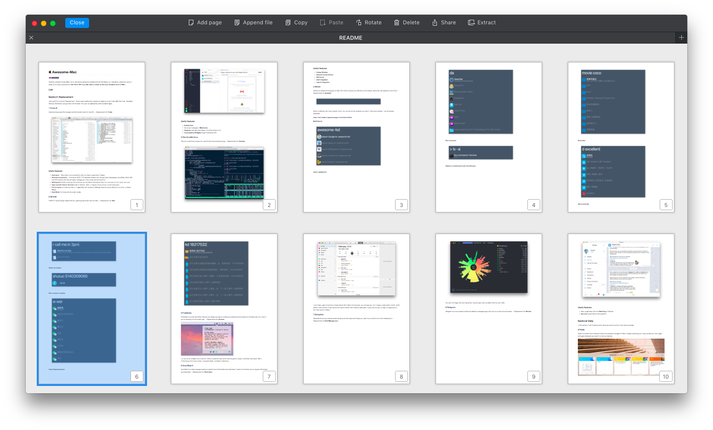

It's a small-size and convenient PDF tools. All basic functions are included such as split the PDF files.

#### 22 [SourceTree](https://www.sourcetreeapp.com/)

_Sourcetree simplifies how you interact with your Git repositories so you can focus on coding. Visualize and manage your repositories through Sourcetree's simple Git GUI._

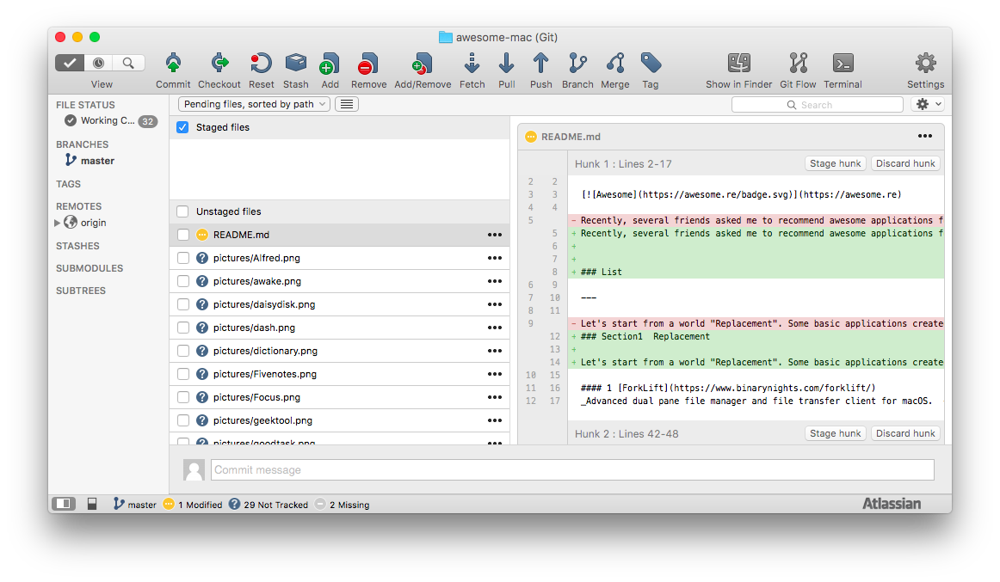

I only use this git client, so I cannot say that it's better that other clients. But I can say that all I need is here.

#### 23 [Countdown Widget](https://itunes.apple.com/us/app/countdown-widget/id506996014?mt=12)

_Countdown widget is a timekeeper always on the bottom of your computer desktop(NOT affect your job), that tell you exactly how many days has passed or is remaining for all the event that are important to you_

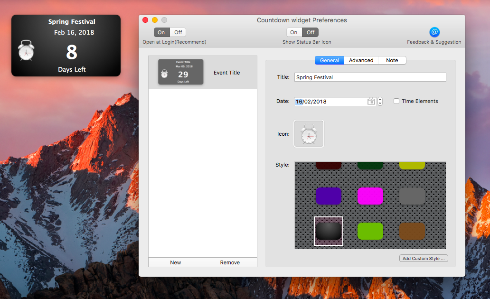

Especially usefully when you are in the final week of a semester.

#### 24 [MarginNote X](https://marginnote.com/)
_MarginNote is a powerful reading tool for learners. Whether you are a student, a teacher, a researcher, a lawyer or someone with a curious mind to learn, MarginNote can help you quickly organize, study and manage large volumes of PDFs and EPUBs. All in one learning app enables you to highlight PDF and EPUB, take note, create mind map, review flashcards and saves you from switching endlessly between different Apps._

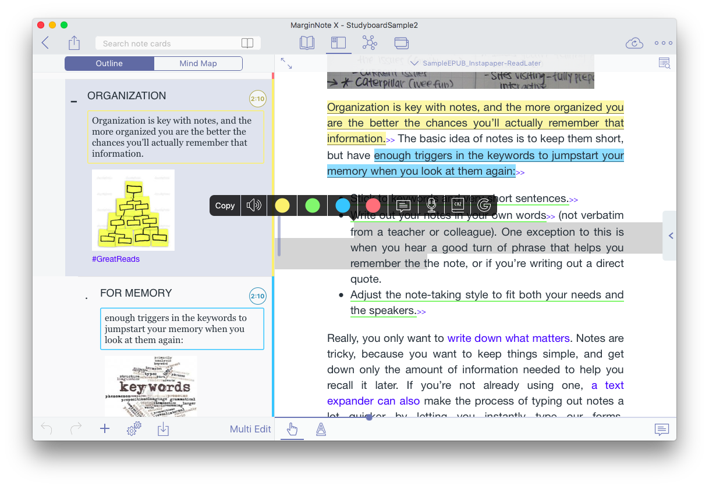

Recommended by my friends. I usually use this app to take notes directly on the PPTs provided by the lecturer. It's very powerful and convenient.

#### 25 [MindNode](https://mindnode.com/)

_MindNode helps you visualize your ideas. Start with a central thought and then brainstorm, organize and share your mind maps._


I have been a fan of Mindmap for many years. MindNode is a simple application which well represents the idea of Mindmap.


---

### Similar Awesome Links

* [https://github.com/nikitavoloboev/my-mac-os](https://github.com/nikitavoloboev/my-mac-os)

* [https://github.com/jaywcjlove/awesome-mac](https://github.com/jaywcjlove/awesome-mac)

* [https://github.com/iCHAIT/awesome-macOS](https://github.com/iCHAIT/awesome-macOS)

---

That's all. Thanks! If you have any questions, just contact me.


